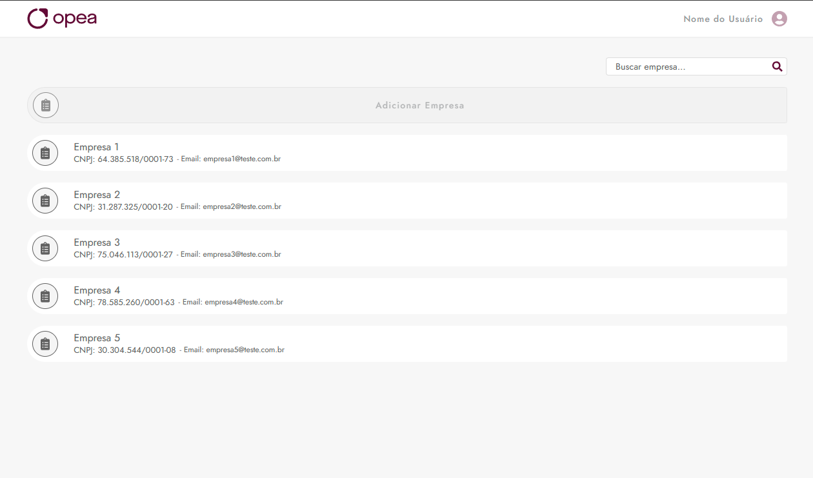

# Opea - Desafio Técnico - Avaliação Front-end

Este é um projeto React que exibe um fluxo básico de listagem, cadastro, edição, busca e exclusão de empresas(clientes).

## Como Usar

Siga as instruções abaixo para executar este projeto em seu ambiente local:

## Pré-requisitos

Antes de iniciar o projeto, certifique-se de ter as seguintes dependências instaladas:

- React
- Node.js
- npm (Node Package Manager)

### Passos para Executar

1. Clone este repositório para o seu computador: 
   `git clone https://github.com/raonicerqueira/opea.git`

2. Navegue até o diretório do projeto:  `cd opea`

3. Instale as dependências do projeto: 
   `npm install`

4. Inicie o aplicativo: 
   `npm start`

5. Abra o navegador e acesse [http://localhost:5173](http://localhost:5173) para visualizar o projeto em execução.

## Recursos

O projeto utiliza os seguintes recursos:

- **React**

- **TypeScript**

- **Zustand**

- **SCSS**

- **Axios**

## Estrutura do Projeto

A estrutura do projeto é organizada da seguinte maneira:

- `src/` - Contém os arquivos JavaScript e assets do projeto.

- `components/` - Aqui estão os componentes React, cada um em seu próprio arquivo.

- `img/` - Este diretório contém imagens e ícones usados na aplicação.

- `stores/` - Contém as definições de stores que gerenciam o estado global da aplicação.

- `styles/` - Arquivos de estilo, SCSS, são armazenados aqui.

- `types/` - Este diretório contém tipos e interfaces TypeScript usados em alguns lugares do projeto.

- `utils/` - Funções utilitárias são armazenadas aqui.

- `App.js` - O arquivo principal que contém a lógica do aplicativo e a renderização dos componentes.

- `index.js` - O ponto de entrada do aplicativo React.

- `README.md` - Este arquivo de documentação.

---

## Contribuindo

Se você deseja contribuir para este projeto, sinta-se à vontade para abrir problemas (issues) ou enviar solicitações de pull (pull requests) para melhorias e correções.

## Autor

Este projeto foi desenvolvido por [Raoni Cerqueira](https://github.com/raonicerqueira).
